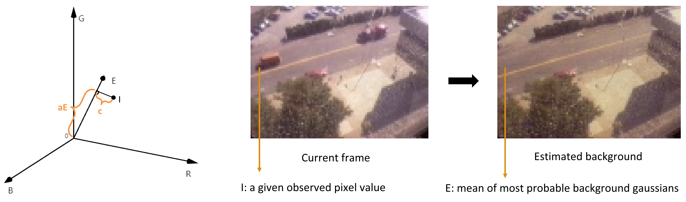

# background-subtraction

## 1. GMM
“pixel process” is defined as a time series of pixel values. For example, the recent history of pixel 
 
is
. 
Then, for each pixel, a Gaussian mixture model is constructed to predict the probability of observing the value of each respective pixel:

The number of Gaussian distributions K is usually from 3 to 5.

### Initialization
One way to initialize the Gaussian models is to take all the pixel values in the first frame of the video, and find 3 to 5 clusters as the means of the Gaussian distributions.

### Update
After initialization, we update the model: 
First, each time a new frame occurs, each pixel in the frame is checked against existing K Gaussian distributions corresponding to that specific pixel. This in practice means the new pixel value falls within the range of 2.5 times standard deviation. 

If the new pixel value does not fall into any distributions’ range of 2.5 times standard deviation, we go to the second step, where the Gaussian distribution with the smallest prior weight, or omega, is updated by: the mean is shifted to the new pixel value, with a considerably high variance and low prior weight.
After that the prior weights are normalized to sum up to be 1. 

Third, the prior weights are updated according to the following formulas:

where 
is the learning rate, and 

is a vector, whose values are determined by which distribution is matched. The element corresponding to the matched distribution is 1, and the others are 0. Please note that the learning rate determines to what extent the new pixel value determine the distribution. 

Finally, the parameters of the matched distribution are updated:

Please note that 

describes "How much the new data agrees with the old distribution". The larger the 

, the more the new data counts.  
Moreover, it can be seen that one advantage of GMM is that when something becomes part of the background, it doesn't destroy the existing model of the background.

### Background estimation
To figure out “what part of the mixture is produced by the background”, we define those Gaussians as “background Gaussian”. 
Since we assume that the background is something that stably localizes at a pixel, we define that the distributions with the most supporting evidence and the least variance will account for the background. 
The supporting evidence is measured by 

, so we look for a large omega and at the same time, a small variance.
Therefore, first, we rank the gaussians in the descending order in terms of 
. 

In the sorted list, the first will the most probable gaussian, that is, the distribution most likely to be the background. It is followed by less probable gaussian, which is considered to be a transient background. The last is the least representative of the background, and in many cases it will be replaced with the new color.

Second, we choose the first B sorted distributions as the Background Gaussian, and, B is calculated this way. Here, B is the minimum number of gaussians s.t. the sum of their weights exceeds a constant, T. Therefore, we can consider T as a measure of the minimum portion of the data accounted for the background. 
If T is small, the background becomes unimodal. If T is large, the background model will be more complex and can include more colors caused by repetitive background motions. For example, the repetitive patterns caused by the moving leaves on a tree, or the patterns of a flag in the wind.

After getting the background gaussians of each frame, we can detect foreground and background. Given the current frame, GMM returns the foreground mask and the estimated background. The foreground mask is composed of 0 or 1. If a pixel matches one of the background gaussians, it is background, so the pixel value will be 0. Else, the pixel value is 1. 
In an estimated background, for each pixel, its value will be the mean of its most probable gaussian. Therefore, this estimated background basically shows how the scene would look like without any foreground.

### Evaluation of GMM
Innocation: 
It tries to model multiple surfaces appear in a pixel. Therefore, even though the pixel changes at this moment, the previous colors will still be modeled. That’s the reason why it can cope with gradual illumination change, small repetitive motions and small camera displacement.

Disadvantage: 
(i) It cannot deal with sudden, drastic lighting changes. It is because the Gaussian of sudden color change will have a small 
and a large 

, so it will not be considered as a background gaussian.  
(ii) Initialization matters. 

## 2. GMM with shadow detection
One of GMM's shortcomings it that it performs bad in detecting shadows because it doesn't attempt to label Gaussian components as moving shadows. To fix this, Bowden proposes a method. 

### Color model
One of the fundamental abilities of human vision is color constancy: Humans tend to assign a constant color to an object even under changing illumination. However, computers cannot tell shadows just from looking at its RGB value.  
The perceived color of a point in a scene depends on many factors including physical properties the surface of the object. On perfectly matte surfaces, the perceived color is the product of illumination and surface spectral reflectance. Here, surface spectral reflectance is a measure of how much energy a surface reflects at a specific wavelength, and it is invariant to illumination change.  
For shadow and background, they have same surface reflectance, but different illumination. Therefore, if we want to know whether a pixel is a part of shadow, we just need to compare its chromaticity and brightness with that of the background.  
Therefore, as proposed by Bowden et al., we design a color model to decompose the difference between shadow and background into brightness distortion, denoted as a, and chromaticity distortion, denoted as c. This gives us the color model proposed by Horprasert in RGB space:

where E is the value of a pixel in the estimated background, or the expected value of its most probable gaussian, and I is the gray value of the same pixel in the current image. The brightness distortion a is the scalar value that brings the observed gray value close to the expected gray value, and Color distortion c is the orthogonal distance between the observed and the expected.

### Shadow detection
GMM gives a foreground mask and an estimated background. For the pixels classified as foreground, we get its pixels value I and the corresponding background pixel value E. We put it into the model and calculate brightness distortion a and Color distortion c. If a and c are within some thresholds we set, the pixel is considered as a shadow.

The image below shows the comparison of the results of GMM and MOG. The shadows in the third line are detected better, and it proves that the proposed method does work better.

